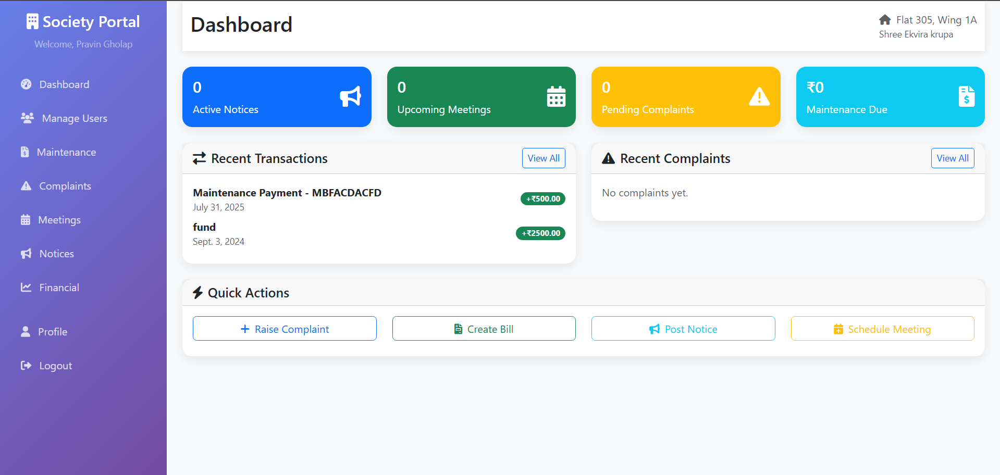
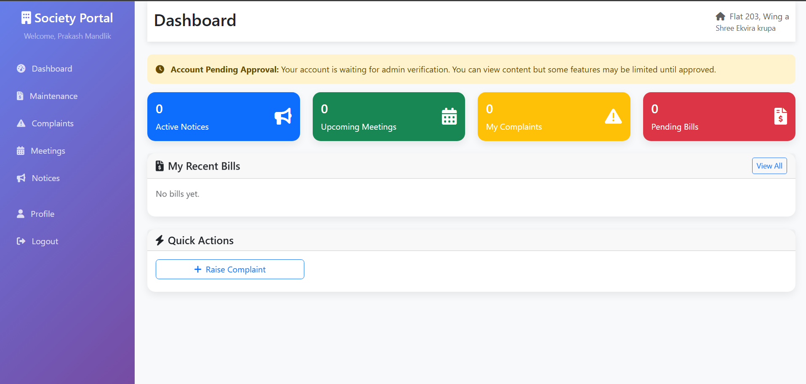
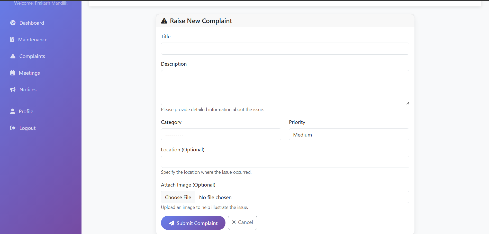

# 🏡 Housing Society Management System

A **Django-based web application** for seamless management of residential housing societies.  
Designed to **streamline maintenance, communication, and financial operations** for **admins, owners, and tenants**.

---

## ✨ Key Features
- **Admin Panel:** Manage members, maintenance bills, notices, complaints, and meetings.
- **Owner/Tenant Portal:** Pay maintenance charges, raise complaints, and view notices.
- **Financial Management:** Track bills, payments, and generate reports.
- **Communication Hub:** Receive real-time updates and meeting schedules.

---

## ⚙️ How to Run Locally

# 1️⃣ Clone the repository
git clone https://github.com/Pravindgholap/housing_soc.git
cd housing_soc

# 2️⃣ Create virtual environment and activate
python -m venv venv
# Windows
venv\Scripts\activate
# macOS/Linux
source venv/bin/activate

# 3️⃣ Install dependencies
pip install -r requirements.txt

# 4️⃣ Apply migrations & create superuser
python manage.py makemigrations
python manage.py migrate
python manage.py createsuperuser

# 5️⃣ Run the development server
python manage.py runserver
Access at: http://127.0.0.1:8000/

🖼 Screenshots
### Admin Dashboard

### User Dashboard

### Financial Management

### Complaints

> **Note:** For more screenshots and page views, check the [`screenshots/`](screenshots) folder.

🛠 Tech Stack

Backend: Django, Python

Frontend: HTML, CSS, Bootstrap

Database: SQLite (default), PostgreSQL supported
